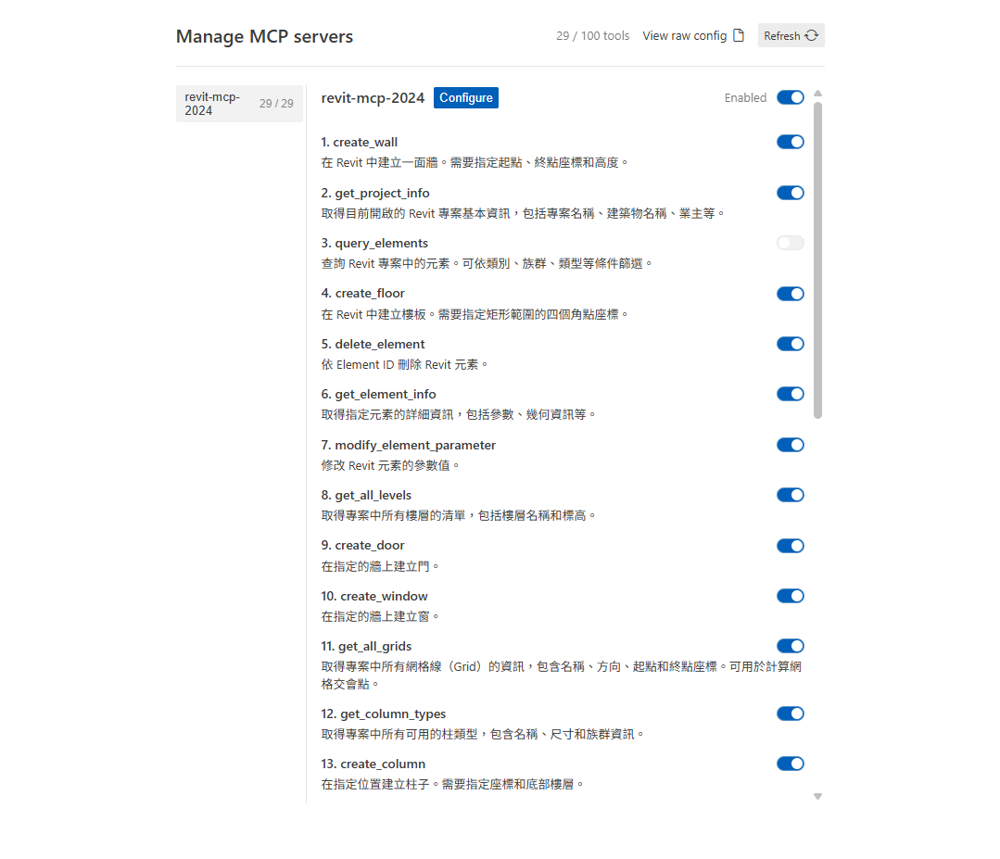

# Antigravity Revit MCP Server 完全操作手冊

> **適用對象**：使用 Antigravity (Gemini CLI) 並想要手動配置或管理 Revit MCP Server 的使用者  
> **版本**：2.0.0  
> **最後更新**：2026-01-23  
> **Revit 版本**：2022 / 2023 / 2024

---

## 📋 目錄

1. [快速索引](#快速索引)
2. [Part 1: 如何移除已配置的 Revit MCP](#part-1-如何移除已配置的-revit-mcp)
3. [Part 2: 手動配置完整流程](#part-2-手動配置完整流程)
4. [Part 3: 官方參考文件](#part-3-官方參考文件)
5. [Part 4: 正式步驟作業教學](#part-4-正式步驟作業教學)
6. [除錯與常見問題](#除錯與常見問題)

---

## 快速索引

| 需求 | 跳轉章節 |
|:-----|:---------|
| 我想移除 Revit MCP | [Part 1](#part-1-如何移除已配置的-revit-mcp) |
| 我想從頭手動建置 | [Part 2](#part-2-手動配置完整流程) |
| 我想看官方文件 | [Part 3](#part-3-官方參考文件) |
| 我想看完整教學 | [Part 4](#part-4-正式步驟作業教學) |
| MCP Server 無法啟動 | [除錯章節](#除錯與常見問題) |

---

# Part 1: 如何移除已配置的 Revit MCP

## 🗑️ 情境說明

當您想要：
- 完全移除 Revit MCP Server 從 Antigravity
- 清理專案檔案
- 重新開始配置

請按照以下步驟操作。

---

## 步驟 1: 移除 Antigravity 設定檔中的 MCP Server (透過 UI)

### 1.1 進入 MCP 管理介面

1.  開啟 **Antigravity IDE**。
2.  點選視窗**右上角**的選單按鈕（通常是 `...` 或漢堡選單）。
3.  在下拉選單中選擇 **「MCP Servers」**。

### 1.2 編輯原始設定

1.  在開啟的 **Manage MCP servers** 頁面中，點選下方或側邊的 **「View raw config」** (查看原始設定)。
2.  這會開啟一個 JSON 編輯介面。
3.  移除整個 `revit-mcp-2024` 的設定區塊（注意括號與逗號的對應）。

### 1.3 儲存並重新整理

1.  移除完成後，關閉設定編輯。
2.  點選頁面上的 **「Refresh」** (重新整理) 按鈕。
3.  確認列表中的 `revit-mcp-2024` 已消失。

---

## 步驟 2: 移除 Revit Add-in（可選）

如果您想要完全清除 Revit 中的 MCP 外掛：

### 2.1 找到 Revit Addins 資料夾

根據您的 Revit 版本：

| Revit 版本 | Add-in 路徑 |
|:----------|:----------|
| 2022 | `C:\ProgramData\Autodesk\Revit\Addins\2022\RevitMCP\` |
| 2023 | `C:\ProgramData\Autodesk\Revit\Addins\2023\RevitMCP\` |
| 2024 | `C:\ProgramData\Autodesk\Revit\Addins\2024\RevitMCP\` |

### 2.2 刪除檔案

刪除整個 `RevitMCP` 資料夾，或刪除以下檔案：
```
RevitMCP\
├── RevitMCP.dll
└── RevitMCP.addin
```

### 2.3 驗證移除成功

1. 重新開啟 Revit
2. 點選「附加元件 (Add-Ins)」標籤
3. 確認不再有 「RevitMCP」外掛按鈕

---

## 步驟 3: 清理專案檔案（可選）

如果您想要完全刪除專案：

```powershell
# 刪除整個專案資料夾
Remove-Item -Recurse -Force "C:\Users\Use\Desktop\REVIT_MCP"
```

⚠️ **警告**：這會刪除所有專案檔案，請確認已備份重要資料！

---

## 驗證移除完成

完成以上步驟後，執行以下檢查：

### ✅ Antigravity 檢查
```
1. 啟動 Antigravity
2. 輸入 /mcp
3. 選擇 "list"
4. 確認清單中沒有 "revit-mcp-2024"
```

### ✅ Revit 檢查
```
1. 開啟 Revit
2. 檢查「附加元件」標籤
3. 確認沒有 RevitMCP 按鈕
```

---

# Part 2: 手動配置完整流程

## 🛠️ 需要開啟和編輯的檔案清單

在開始之前，請準備好以下檔案的編輯器（建議使用 VS Code）：

| 檔案 | 用途 | 必須性 |
|:-----|:-----|:------|
| `mcp_config.json` | Antigravity 的 MCP Server 設定檔 | ✅ 必須 |
| `RevitMCP.2024.csproj` | C# 專案建置檔 (Revit 2024) | ✅ 必須 |
| `RevitMCP.csproj` | C# 專案建置檔 (Revit 2022/2023) | ✅ 必須 |
| `package.json` | Node.js 專案設定 | 📖 參考 |
| `install-addon-bom.ps1` | 自動安裝腳本 | 🔧 選用 |

---

## 核心檔案位置地圖

```
Antigravity IDE 內部設定管理
└── 右上角選單 -> MCP Servers -> View raw config
    (這會對應到系統底層的設定檔，但建議透過 UI 編輯以確保同步)

專案目錄\REVIT_MCP\
├── MCP\
│   ├── RevitMCP.2024.csproj  ← Revit 2024 建置檔
│   ├── RevitMCP.csproj       ← Revit 2022/2023 建置檔
│   ├── CommandExecutor.cs    ← 核心邏輯
│   └── bin\Release.2024\     ← 編譯輸出 (2024)
│       └── RevitMCP.dll
│
└── MCP-Server\
    ├── package.json          ← Node.js 依賴設定
    ├── src\
    │   └── tools\
    │       └── revit-tools.ts ← MCP 工具定義
    └── build\
        └── index.js          ← **MCP Server 入口檔（重要！）**
```

---

## 手動配置的核心概念

### 🔗 Antigravity ↔ MCP Server ↔ Revit 的連接邏輯

```
┌──────────────┐         ┌──────────────┐         ┌──────────────┐
│ Antigravity  │  開啟   │ Manage MCP   │  編輯   │ Raw Config   │
│     IDE      │ ──────> │   Servers    │ ──────> │   (JSON)     │
└──────────────┘         └──────────────┘         └──────────────┘
                                                          │
                                                          │ 執行 (node index.js)
                                                          ↓
                                                   ┌──────────────┐
                                                   │  MCP Server  │
                                                   │  (Node.js)   │
                                                   └──────────────┘
                                                          │
                                                          │ WebSocket (8964)
                                                          ↓
                                                   ┌──────────────┐
                                                   │    Revit     │
                                                   └──────────────┘
                                                          │
                                                          │ WebSocket
                                                          │ Port: 8964
                                                          ↓
                                                   ┌──────────────┐
                                                   │    Revit     │
                                                   │   Add-in     │
                                                   │ (RevitMCP.dll)│
                                                   └──────────────┘
```

### 關鍵理解點

1. **Antigravity 啟動時**：
   - 讀取 `~/.gemini/antigravity/mcp_config.json`
   - 根據 `command` 和 `args` 啟動 Node.js 執行 `build/index.js`

2. **MCP Server 啟動後**：
   - 開啟 WebSocket 伺服器在 Port 8964
   - 等待 Revit Add-in 連接

3. **Revit 開啟時**：
   - 載入 `RevitMCP.dll`
   - 連接到 `localhost:8964`
   - 建立雙向通訊

---

# Part 3: 官方參考文件

## 📚 Antigravity 操作指引

### 核心功能位置

| 功能 | 操作路徑 | 說明 |
|:-----|:---------|:-----|
| **MCP Server 設定** | 右上角選單 `...` → `MCP Servers` | 管理所有連接的 MCP 伺服器 |
| **編輯設定檔** | `MCP Servers` 頁面 → `View raw config` | 直接編輯 JSON 設定 (推薦) |
| **重整連線** | `MCP Servers` 頁面 → `Refresh` | 修改設定後必須執行 |
| **官方文件 (內部)** | `https://antigravity.google/docs/` | 僅限 Google 內網存取 |

### MCP 協定官方規範

| 文件 | 網址 | 說明 |
|:-----|:-----|:-----|
| **MCP 協定首頁** | https://modelcontextprotocol.io/ | Model Context Protocol 官方規範 |
| **MCP Server 開發指南** | https://modelcontextprotocol.io/docs/server | 如何開發 MCP Server |
| **MCP Tools 規範** | https://modelcontextprotocol.io/docs/concepts/tools | 工具 (Tools) 的定義格式 |

---

## 🏗️ Revit API 官方資源

| 資源 | 網址 | 說明 |
|:-----|:-----|:-----|
| **Revit API 文件** | https://www.revitapidocs.com/ | Revit API 完整參考 |
| **Revit Developer Center** | https://www.autodesk.com/developer-network/platform-technologies/revit | Autodesk 官方開發者中心 |
| **Revit Add-in 開發指南** | https://help.autodesk.com/view/RVT/2024/ENU/?guid=Revit_API_Revit_API_Developers_Guide_html | 官方開發者指南 |

---

## 🔧 本專案特有文件

本專案已整理完整的技術文件在以下位置：

```
REVIT_MCP\
├── README.md                    ← 專案總覽與快速開始
├── ARCHITECTURE.md              ← 架構設計文件
├── GEMINI.md                    ← AI 協作指南（重要！）
├── docs\
│   └── tools\
│       ├── override_element_color_design.md  ← 元素上色設計文件
│       └── override_graphics_examples.md     ← 圖形覆蓋範例
└── domain\
    ├── element-coloring-workflow.md  ← 元素上色工作流程
    └── room-boundary.md              ← 房間邊界處理流程
```

**建議閱讀順序**：
1. `README.md` - 理解專案目的
2. `GEMINI.md` - 理解專案結構與 AI 協作規則
3. `ARCHITECTURE.md` - 理解系統架構
4. `domain/` 下的工作流程文件 - 理解具體業務流程

---

# Part 4: 正式步驟作業教學

## 🚀 完整手動配置流程（Step by Step）

### 前置作業：環境檢查

執行以下指令確認環境：

```powershell
# 檢查 Node.js 版本（需要 >= 18.0.0）
node --version

# 檢查 npm 版本
npm --version

# 檢查 .NET SDK 版本（需要 >= 6.0）
dotnet --version

# 檢查 Revit 版本
# 手動開啟 Revit，點選「說明」→「關於 Autodesk Revit」
```

如果缺少任何工具，請先安裝：
- **Node.js**: https://nodejs.org/ (下載 LTS 版本)
- **.NET SDK**: https://dotnet.microsoft.com/download
- **Revit**: https://www.autodesk.com/products/revit/

---

### 階段一：取得專案原始碼

#### 選項 A：使用 Git Clone（推薦）

```powershell
# 進入您想要存放專案的目錄
cd C:\Users\Use\Desktop

# Clone 專案（請替換成實際的 Git Repository URL）
git clone https://github.com/您的帳號/REVIT_MCP.git REVIT_MCP

# 進入專案目錄
cd REVIT_MCP
```

#### 選項 B：下載 ZIP 檔案

1. 前往 GitHub Repository
2. 點選「Code」→「Download ZIP」
3. 解壓縮到 `C:\Users\Use\Desktop\REVIT_MCP`

---

### 階段二：建置 C# Add-in（Revit 外掛）

#### Step 1: 確認 Revit 版本並選擇專案檔

| 您的 Revit 版本 | 使用的專案檔 | 建置指令 |
|:---------------|:-----------|:---------|
| Revit 2022 | `RevitMCP.csproj` | `dotnet build -c Release RevitMCP.csproj` |
| Revit 2023 | `RevitMCP.csproj` | `dotnet build -c Release RevitMCP.csproj` |
| Revit 2024 | `RevitMCP.2024.csproj` | `dotnet build -c Release RevitMCP.2024.csproj` |

#### Step 2: 執行建置

```powershell
# 進入 C# 專案目錄
cd C:\Users\Use\Desktop\REVIT_MCP\MCP

# 執行建置（以 Revit 2024 為例）
dotnet build -c Release RevitMCP.2024.csproj
```

**預期輸出**：
```
Microsoft (R) Build Engine version ...
正在建置專案 ...
建置成功。

警告: 56 個（僅限 Revit 2024，這是正常的）
錯誤: 0 個
```

⚠️ **重要說明**：
- **Revit 2024** 會顯示 56 個警告（關於 `ElementId` 型別），這是正常的，不影響功能
- **Revit 2022/2023** 不應該有警告

#### Step 3: 檢查編譯輸出

確認 DLL 已成功產生：

```powershell
# Revit 2024
dir MCP\bin\Release.2024\RevitMCP.dll

# Revit 2022/2023
dir MCP\bin\Release\RevitMCP.dll
```

如果看到檔案資訊（檔案大小、修改時間），表示建置成功！

---

### 階段三：部署 Revit Add-in

#### 選項 A：使用自動安裝腳本（推薦）

```powershell
# 回到專案根目錄
cd C:\Users\Use\Desktop\REVIT_MCP

# 執行安裝腳本
.\scripts\install-addon-bom.ps1
```

**互動流程**：
```
請選擇 Revit 版本:
1) 2022
2) 2023
3) 2024
請輸入選項 (1-3): 3

正在複製檔案到 C:\ProgramData\Autodesk\Revit\Addins\2024\RevitMCP\...
✓ 安裝完成！
```

#### 選項 B：手動部署

##### B-1: 建立目標資料夾

根據您的 Revit 版本：

```powershell
# Revit 2024 範例
New-Item -ItemType Directory -Path "C:\ProgramData\Autodesk\Revit\Addins\2024\RevitMCP" -Force
```

##### B-2: 複製檔案

```powershell
# 複製 DLL（Revit 2024）
Copy-Item "MCP\bin\Release.2024\RevitMCP.dll" "C:\ProgramData\Autodesk\Revit\Addins\2024\RevitMCP\" -Force

# 複製 .addin 檔案
Copy-Item "MCP\RevitMCP.addin" "C:\ProgramData\Autodesk\Revit\Addins\2024\RevitMCP\" -Force
```

##### B-3: 驗證檔案

確認目標資料夾包含：
```
C:\ProgramData\Autodesk\Revit\Addins\2024\RevitMCP\
├── RevitMCP.dll
└── RevitMCP.addin
```

---

### 階段四：建置 MCP Server（Node.js）

#### Step 1: 安裝 Node.js 依賴

```powershell
# 進入 MCP-Server 目錄
cd C:\Users\Use\Desktop\REVIT_MCP\MCP-Server

# 安裝依賴
npm install
```

**預期輸出**：
```
added [...] packages in [...]s
```

#### Step 2: 建置 TypeScript

```powershell
# 執行建置
npm run build
```

**預期輸出**：
```
> mcp-server@1.0.0 build
> tsc

建置完成！
```

#### Step 3: 驗證建置輸出

確認入口檔案已產生：

```powershell
dir build\index.js
```

應該看到 `index.js` 檔案。

---

### 階段五：配置 Antigravity (UI 版)

#### Step 1: 進入設定介面

1.  開啟 **Antigravity IDE**。
2.  點選右上角選單 -> **「MCP Servers」**。
3.  進入 **Manage MCP servers** 分頁。

目標結果顯示:


#### Step 2: 編輯 Raw Config (核心步驟)

請將以下 JSON 程式碼**完整複製**，並貼入 `mcpServers` 的大括號 `{ ... }` 之中。

**📋 程式碼範本 (請複製這段)：**

```json
    "revit-mcp-2024": {
      "command": "node",
      "args": [
        "[您的專案絕對路徑]\\MCP-Server\\build\\index.js"
      ],
      "env": {
        "REVIT_VERSION": "2024"
      },
      "disabled": false,
      "autoApprove": []
    }
```

> 💡 **教學：如何快速取得「[您的專案絕對路徑]」？**
> 1. 在檔案總管找到 `index.js` 所在的資料夾。
> 2. 按住鍵盤上的 **Shift** 鍵，同時在該資料夾（或檔案）上按 **滑鼠右鍵**。
> 3. 選擇 **「複製為路徑 (Copy as path)」**。
> 4. 貼上後，請手動將單反斜線 `\` 修改為**雙反斜線 `\\`**。

**🔍 程式碼解構與教學 (為什麼這樣寫？)**

| 參數 (Key) | 設定值 (Value) | 邏輯與原因說明 |
|:---|:---|:---|
| **`revit-mcp-2024`** | (自定義名稱) | 這是 Server 的**唯一識別碼**。Antigravity 透過此名稱來識別不同的工具集。建議加上年份 (2024) 以區分不同版本。 |
| **`command`** | `"node"` | 指定執行環境。因為我們的 MCP Server 是用 TypeScript/JavaScript 寫的，所以必須呼叫 Node.js 來執行它。 |
| **`args`** | `["...index.js"]` | 指定伺服器的入口檔案位置。由於 Antigravity 運行在系統層級，使用**絕對路徑**能避免因相對路徑產生的載入錯誤。 |
| **`env`** | `{"REVIT_VERSION":...}` | 設定環境變數。這告訴 MCP Server 目前是針對哪個 Revit 版本運作，讓程式內部能載入正確的 DLL 邏輯。 |
| **`disabled`** | `false` | 預設為啟用。若設為 `true`，可以在不刪除設定的情況下暫時關閉此 Server。 |

**💡 常見錯誤提醒：**
1. **路徑轉義**：JSON 語法中，反斜線是特殊字元，所以路徑 `C:\Users` 必須寫成 `C:\\Users` 才能被正確讀取。
2. **逗號遺漏**：如果您是貼在現有的 Server 後面，記得在前一個 Server 的結尾大括號 `}` 後面加上**逗號 `,`**。

#### Step 3: 更新並重新整理

1.  編輯完成後，儲存設定。
2.  在 **Manage MCP servers** 頁面中點選 **「Refresh」** 按鈕。
3.  確認列表中出現 `revit-mcp-2024` 且狀態為正常。

---

### 階段六：啟動與驗證

#### Step 1: 重新整理

1. 在 **Manage MCP servers** 介面點選 **Refresh**。
2. 或直接重啟 Antigravity IDE。

如果沒有顯示，請參考[除錯章節](#除錯與常見問題)。

#### Step 3: 使用斜線指令驗證

在 Antigravity 對話介面輸入：
```
/mcp
```

選擇 `list` 選項，應該看到：
```
Available MCP Servers:
- revit-mcp-2024
  Tools:
    - execute_revit_command
    - get_model_info
    - list_elements
    - ...
```

#### Step 4: 開啟 Revit 並測試連接

1. 開啟 Revit 2024
2. 點選「附加元件 (Add-Ins)」標籤
3. 應該看到「RevitMCP」按鈕
4. 開啟任意 Revit 專案檔（.rvt）

#### Step 5: 在 Antigravity 中測試 MCP 工具

輸入以下測試指令：
```
請使用 get_model_info 工具取得目前 Revit 模型的資訊
```

**預期結果**：
- Antigravity 會自動呼叫 `revit-mcp-2024` 的 `get_model_info` 工具
- 返回目前開啟的 Revit 模型資訊（專案名稱、元素數量等）


---

## 🎯 完整流程驗證清單

完成以上所有步驟後，請確認：

### ✅ C# Add-in 檢查
- [ ] `RevitMCP.dll` 已成功編譯
- [ ] DLL 已複製到 Revit Addins 資料夾
- [ ] `.addin` 檔案已複製到 Revit Addins 資料夾
- [ ] 開啟 Revit 時沒有載入錯誤訊息
- [ ] 「附加元件」標籤中出現 RevitMCP 按鈕

### ✅ MCP Server 檢查
- [ ] `npm install` 成功執行
- [ ] `npm run build` 成功執行
- [ ] `build/index.js` 檔案存在

### ✅ Antigravity 設定檢查
- [ ] `mcp_config.json` JSON 格式正確
- [ ] 路徑使用雙反斜線 `\\`
- [ ] 路徑指向正確的 `build/index.js`
- [ ] Antigravity 啟動時顯示 MCP Server 名稱
- [ ] `/mcp list` 可以看到工具清單

### ✅ 整合測試
- [ ] Revit 已開啟並載入專案檔
- [ ] Antigravity 可以成功呼叫 Revit MCP 工具
- [ ] 工具執行結果正確回傳

---

# 除錯與常見問題

## ❌ 問題 1: Antigravity 啟動時沒有顯示 MCP Server

### 可能原因與解決方案

#### 原因 A: JSON 格式錯誤

**症狀**：
```
✗ Failed to load MCP config
```

**解決方案**：
1. 使用 https://jsonlint.com/ 驗證 JSON
2. 常見錯誤：
   - 缺少逗號：`"key": "value" "key2": "value2"` ❌
   - 多餘逗號：`{"key": "value",}` ❌
   - 單反斜線：`"C:\Users"` ❌（應為 `"C:\\Users"` ✅）

#### 原因 B: 路徑錯誤

**症狀**：
```
✗ revit-mcp-2024: Command not found
```

**解決方案**：
```powershell
# 檢查 Node.js 路徑
where.exe node
# 輸出：C:\Program Files\nodejs\node.exe

# 檢查 MCP Server 入口檔案是否存在
Test-Path "C:\Users\Use\Desktop\REVIT_MCP\MCP-Server\build\index.js"
# 應該輸出：True
```

更新 `mcp_config.json` 中的路徑為實際路徑。

#### 原因 C: 權限問題

**症狀**：
```
✗ revit-mcp-2024: Access denied
```

**解決方案**：
以系統管理員權限執行 Antigravity：
1. 右鍵點選 Antigravity 捷徑
2. 選擇「以系統管理員身分執行」

---

## ❌ 問題 2: MCP Server 啟動但無法連接 Revit

### 可能原因與解決方案

#### 原因 A: Revit Add-in 未載入

**檢查方式**：
1. 開啟 Revit
2. 點選「附加元件」標籤
3. 確認有「RevitMCP」按鈕

**如果沒有按鈕**：
```powershell
# 檢查 DLL 是否存在
dir "C:\ProgramData\Autodesk\Revit\Addins\2024\RevitMCP\RevitMCP.dll"

# 檢查 .addin 檔案
dir "C:\ProgramData\Autodesk\Revit\Addins\2024\RevitMCP\RevitMCP.addin"
```

如果檔案不存在，重新執行[階段三](#階段三部署-revit-add-in)。

#### 原因 B: WebSocket Port 被佔用

**檢查方式**：
```powershell
# 檢查 Port 8964 是否被佔用
netstat -ano | findstr :8964
```

**如果有輸出**：
```
TCP    127.0.0.1:8964    0.0.0.0:0    LISTENING    12345
```

表示 Port 被佔用，解決方案：
```powershell
# 找出佔用的程式（PID: 12345）
tasklist | findstr 12345

# 終止該程式（請謹慎操作）
taskkill /PID 12345 /F
```

#### 原因 C: Revit 版本不符

**症狀**：
Revit 顯示載入錯誤：
```
無法載入 RevitMCP.dll：目標 Framework 版本不符
```

**解決方案**：
確認您使用的 `.csproj` 檔案與 Revit 版本一致：
- Revit 2024 → 使用 `RevitMCP.2024.csproj`
- Revit 2022/2023 → 使用 `RevitMCP.csproj`

重新建置正確的專案檔。

---

## ❌ 問題 3: 工具執行失敗

### 症狀

Antigravity 呼叫工具時回傳錯誤：
```
Error: Command execution failed
```

### 可能原因與解決方案

#### 原因 A: Revit 未開啟專案檔

**解決方案**：
確保 Revit 已開啟 `.rvt` 專案檔（不能只開啟 Revit 軟體）。

#### 原因 B: Transaction 衝突

**症狀**：
```
Error: Cannot start transaction while another is active
```

**解決方案**：
等待上一個指令執行完成後再執行下一個指令。

#### 原因 C: 權限不足

**症狀**：
```
Error: Access to element denied
```

**解決方案**：
某些元素可能被鎖定或屬於工作集（Workset）。
確認您有編輯權限。

---

## ❌ 問題 4: 建置時出現警告

### Revit 2024 建置警告

**症狀**：
```
warning CS0618: 'ElementId.IntegerValue' is obsolete
(共 56 個類似警告)
```

**說明**：
✅ **這是正常的！**

Revit 2024 將 `ElementId` 從 `int` 改為 `long`，但為了支援 2022-2024 多版本，專案使用 2022 相容寫法。

這些警告**不影響功能**，可以忽略。

### Revit 2022/2023 建置警告

**如果有警告**：
❌ **這不正常！**

確認使用的是 `RevitMCP.csproj`（不是 `RevitMCP.2024.csproj`）。

---

## 🔍 進階除錯：啟用詳細日誌

### 啟用 MCP Server 日誌

編輯 `MCP-Server/build/index.js`，加入除錯輸出（需要懂一點 JavaScript）：

```javascript
// 在 websocket 連接處加入
console.log('[DEBUG] Revit connected:', clientId);
```

### 查看 Antigravity 日誌

Antigravity 的日誌位置：
```
Windows: %USERPROFILE%\.gemini\logs\
```

可以查看詳細的 MCP 呼叫記錄。

### 查看 Revit 日誌

Revit 的外掛日誌位置：
```
C:\Users\您的使用者名稱\AppData\Local\Autodesk\Revit\<版本>\Journals\
```

---

## 📞 需要進一步協助？

如果以上方法都無法解決問題，請收集以下資訊：

1. **系統資訊**：
   ```powershell
   # Windows 版本
   winver
   
   # Node.js 版本
   node --version
   
   # .NET 版本
   dotnet --version
   ```

2. **錯誤訊息**：
   - Antigravity 啟動畫面的完整訊息
   - Revit 的錯誤對話框截圖
   - 日誌檔案內容

3. **設定檔內容**：
   - `mcp_config.json` 的完整內容（遮蔽隱私資訊）

4. **檔案檢查**：
   ```powershell
   # 產生檔案清單
   dir C:\Users\Use\Desktop\REVIT_MCP\MCP-Server\build
   dir "C:\ProgramData\Autodesk\Revit\Addins\2024\RevitMCP"
   ```

將以上資訊整理後，可以：
- 在專案 GitHub Repository 開啟 Issue
- 聯繫專案維護者
- 在 Autodesk Revit 論壇尋求協助

---

## 🎓 額外學習資源

### 理解 MCP 協定

推薦閱讀：
1. [MCP 協定規範](https://modelcontextprotocol.io/)
2. [Anthropic MCP SDK](https://github.com/anthropics/anthropic-sdk-python/tree/main/examples/mcp)

### 理解 Revit API

推薦資源：
1. [The Building Coder Blog](https://thebuildingcoder.typepad.com/)
2. [Revit API 討論論壇](https://forums.autodesk.com/t5/revit-api-forum/bd-p/160)

### 理解 Node.js 與 TypeScript

推薦課程：
1. [Node.js 官方文件](https://nodejs.org/docs/)
2. [TypeScript 官方手冊](https://www.typescriptlang.org/docs/)

---

## 📝 版本歷史

| 版本 | 日期 | 變更內容 |
|:-----|:-----|:---------|
| 1.0.0 | 2026-01-09 | 建立初始設定指南 |
| 2.0.0 | 2026-01-23 | 新增完整手動配置流程與移除指南 |

---

**文件維護者**：專案團隊  
**最後更新**：2026-01-23  
**適用版本**：Revit 2022 / 2023 / 2024 + Antigravity (Gemini CLI)  

---

## 🌟 快速提示卡

列印或截圖這張表格，方便快速參考：

| 操作 | 指令 |
|:-----|:-----|
| 開啟設定檔 | `code %USERPROFILE%\.gemini\antigravity\mcp_config.json` |
| 重建 C# (2024) | `cd MCP && dotnet build -c Release RevitMCP.2024.csproj` |
| 重建 MCP Server | `cd MCP-Server && npm run build` |
| 檢查 MCP 清單 | Antigravity 中輸入 `/mcp` → `list` |
| 檢查 Port 8964 | `netstat -ano \| findstr :8964` |
| 開啟 Revit Addins 資料夾 | `explorer "C:\ProgramData\Autodesk\Revit\Addins\2024"` |

---

**祝您配置順利！🚀**
